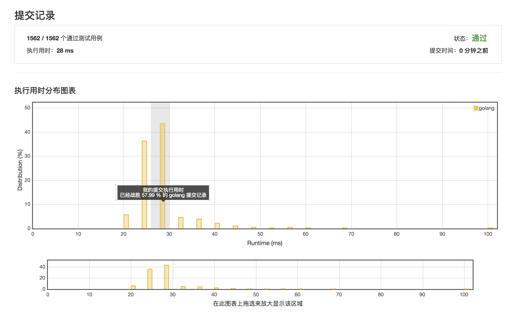

# 两数相加

https://leetcode-cn.com/problems/add-two-numbers/description/

*** 执行用时: 28ms ***



## 执行用时 20ms 的范例

```golang
func addTwoNumbers(l1 *ListNode, l2 *ListNode) *ListNode {
	l := new(ListNode)
	lTmp := l
	carry:=0
	for {
		var v1 int
		var v2 int
		if l1 != nil {
			v1 = l1.Val
			l1 = l1.Next
		}

		if l2 != nil {
			v2 = l2.Val
			l2 = l2.Next
		}

		v := v1 + v2 + carry

		carry = v/10
		lTmp.Val = v%10

		if l1 == nil && l2 == nil {
			break
		}

		lTmp.Next = new(ListNode)
		lTmp = lTmp.Next
	}

	if carry > 0 {
		lTmp.Next = &ListNode{
			Val:carry,
		}
	}

	return l
}
```