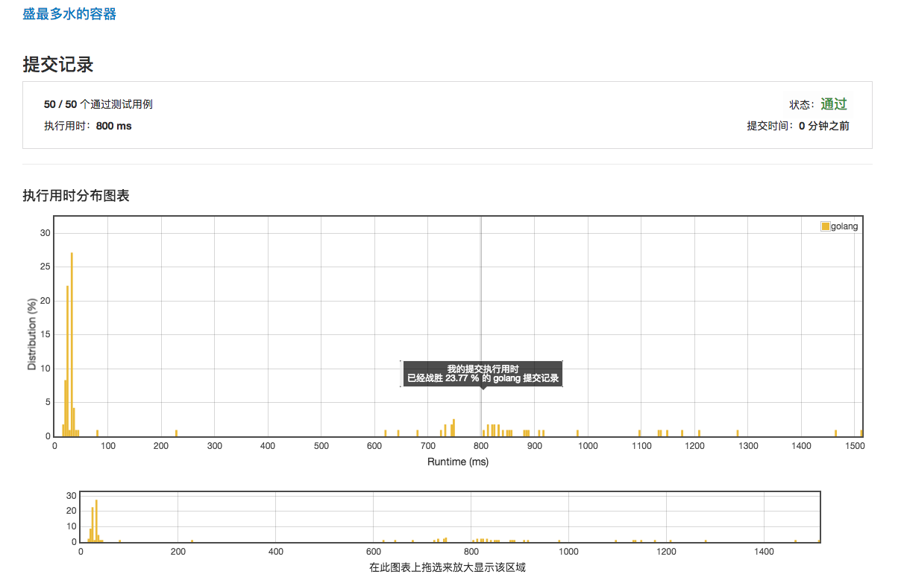

# [11. 盛最多水的容器](https://leetcode-cn.com/problems/container-with-most-water/description/)

## 第一次提交



## 第二次提交：成绩 1104ms


## 第三次提交：成绩 240ms


## 第四次提交：成绩 24ms


## 范例 16ms

```golang
func maxArea(height []int) int {
    i, j := 0, len(height)-1
	maxArea := 0
	lh, rh := height[i], height[j]
	for i < j {

		area := int(math.Min(float64(lh), float64(rh))) * (j - i)

		if area > maxArea {
			maxArea = area
		}

		if lh < rh {
			for i < j && height[i] <= lh {
				i++
			}

			if i < j {
				lh = height[i]
			}
		} else {
			for i < j && height[j] <= rh {
				j--
			}

			if i < j {
				rh = height[j]
			}
		}
	}

	return maxArea
}
```

和第4次提交的不同之处在于，不是逐次调整i, j 进行比较，而是直接找到比当前高度值大的元素，减少了总体循环的次数。见下面这部分代码

```golang
    if lh < rh {
			for i < j && height[i] <= lh {
				i++
			}

			if i < j {
				lh = height[i]
			}
		} else {
			for i < j && height[j] <= rh {
				j--
			}

			if i < j {
				rh = height[j]
			}
		}
```

