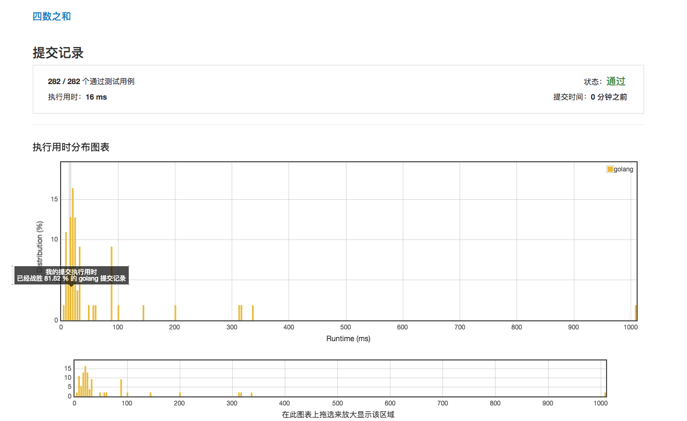

# [18. 四数之和](https://leetcode-cn.com/problems/4sum/description/)

## 第一次提交 参照三数之和的范例 16ms 81.82%



## 范例 4ms

```golang
func fourSum(nums []int, target int) [][]int {
	sort.Ints(nums) //对数组排序
	length := len(nums) //计算数组长度
	var front int 
	var k int 
	s := make([][]int, 0) // 定义一个空的slice

	for i:=0; i < length-3; i++ {
		if i>0&&nums[i]==nums[i-1] {
			continue
		}
    if nums[i]+nums[i+1]+nums[i+2]+nums[i+3]>target {
			break
		}
    if nums[i]+nums[length-3]+nums[length-2]+nums[length-1]<target {
			continue
		}
    for j := i + 1; j < length - 2; j++ { 
			if j>i+1&&nums[j]==nums[j-1] {
				continue
			}
      if nums[i]+nums[j]+nums[j+1]+nums[j+2]>target {
				break
			}
      if nums[i]+nums[j]+nums[length-2]+nums[length-1]<target {
				continue
			}
			front = j + 1
			k = length-1
			for front < k {
        sum := nums[j] + nums[front] + nums[k] + nums[i]
				if sum == target {
					arr := []int{nums[i], nums[j], nums[front], nums[k]}
					s = append(s, arr)
					m:=make([]int, 2)
					m[0]=nums[front]
					m[1] = nums[k]
					for front < k && nums[front] == m[0] {
						front++
					}
					for front < k && nums[k] == m[1] {
						k--
					}
				}
				if sum > target {
					k--
				}
				if sum < target {
					front++
				}
			}
		}
	}
	return s
}
```