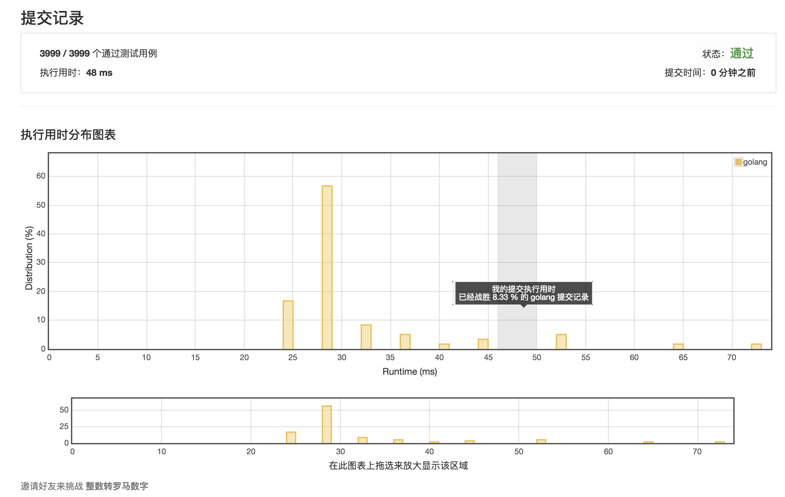
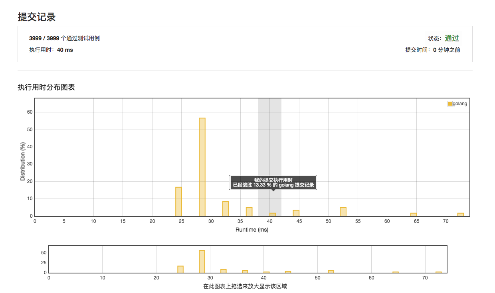
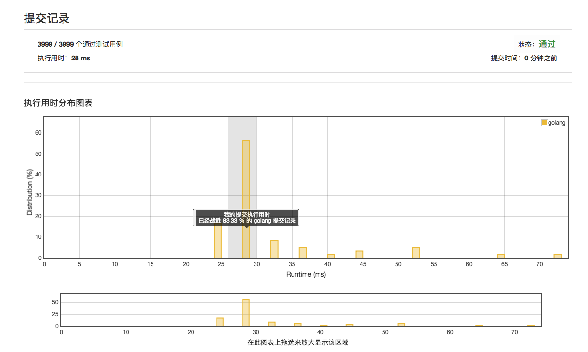

# [12. 整数转罗马数字](https://leetcode-cn.com/problems/integer-to-roman/description/)

# 第一次提交 48ms 8.33%



# 第二次提交 40ms 13.33%



# 范例：24ms

```golang
var intRomanMap = map[int]byte{
	1:    'I',
	5:    'V',
	10:   'X',
	50:   'L',
	100:  'C',
	500:  'D',
	1000: 'M',
}

var speicalCaseMap = map[int][]byte{
	4:   []byte{'I', 'V'},
	9:   []byte{'I', 'X'},
	40:  []byte{'X', 'L'},
	90:  []byte{'X', 'C'},
	400: []byte{'C', 'D'},
	900: []byte{'C', 'M'},
}

var romanOrder = []int{
	1000, 500, 100, 50, 10, 5, 1,
}

func intToRoman(num int) string {
	sb := bytes.NewBuffer(nil)

	for num > 0 {
		highest := highestInt(num)
		if special, exists := speicalCaseMap[highest]; exists {
			sb.Write(special)
			num -= highest
		} else {
			for _, roman := range romanOrder {
				if highest >= roman {
					tmp := num / roman
					remainder := num - tmp*roman

					if special, exists := speicalCaseMap[tmp*roman]; exists {
						sb.Write(special)
					} else {
						c := intRomanMap[roman]
						for i := 0; i < tmp; i++ {
							sb.WriteByte(c)
						}
					}

					num = remainder

					break
				}
			}
		}
	}

	return sb.String()
}

func highestInt(num int) int {
	i := 0

	for num > 10 {
		tmp := num / 10
		i++

		num = tmp
	}

	for j := 0; j < i; j++ {
		num *= 10
	}

	return num
}
```

## 第三次提交 28ms 83.33%

**`string([]byte)`的效率低于`bytes.Buffer.String()`**




## 范例 28ms

```golang
func intToRoman(num int) string {
	bit := [][]string {
		{"", "I", "II", "III", "IV", "V", "VI", "VII", "VIII", "IX"},
		{"", "X", "XX", "XXX", "XL", "L", "LX", "LXX", "LXXX", "XC"},
		{"", "C", "CC", "CCC", "CD", "D", "DC", "DCC", "DCCC", "CM"},
		{"", "M", "MM", "MMM"},
	}
	res := ""
	for i, k := 1000, 3; k >= 0; k-- {
		res = res + bit[k][num / i]
		num = num % i
		i = i / 10
	}
	return res
}
```
