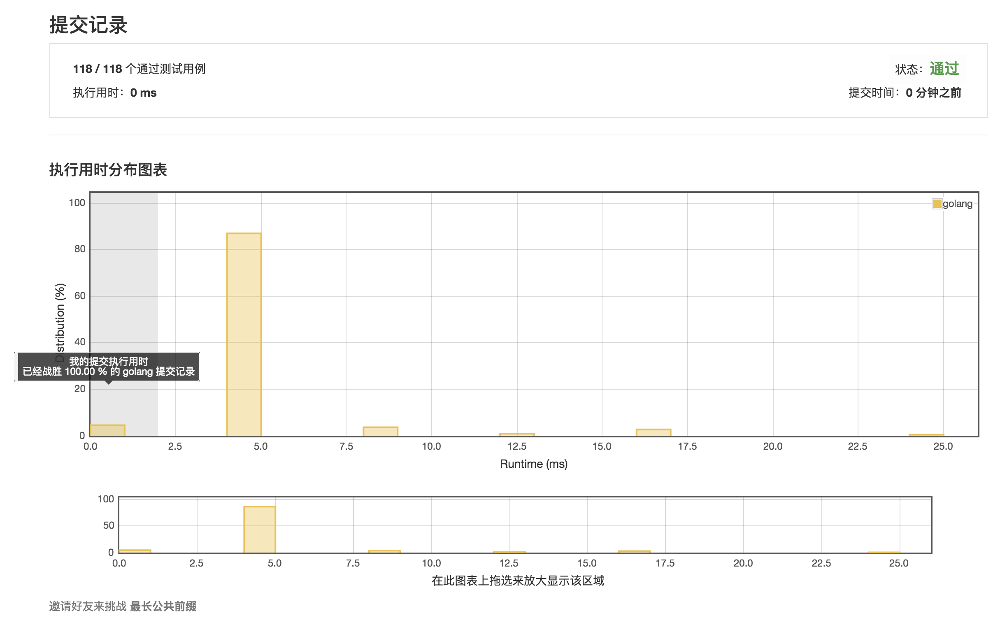

# [14. 最长公共前缀](https://leetcode-cn.com/problems/longest-common-prefix/description/)

## 第一次提交 0ms 100%



## 范例 0ms

```golang
func longestCommonPrefix(strs []string) string {
  if 0 == len(strs) {
		return ""
	}
	if 1 == len(strs) {
		return strs[0]
	}

	lens := 0
	for i := 0; i < len(strs[0]); i++ {
		c := strs[0][i]
		for j := 1; j < len(strs); j++ {
			if i >= len(strs[j]) || c != strs[j][i] {
				goto END
			}
		}
		lens++
	}

END:
	return strs[0][:lens]
}
```
