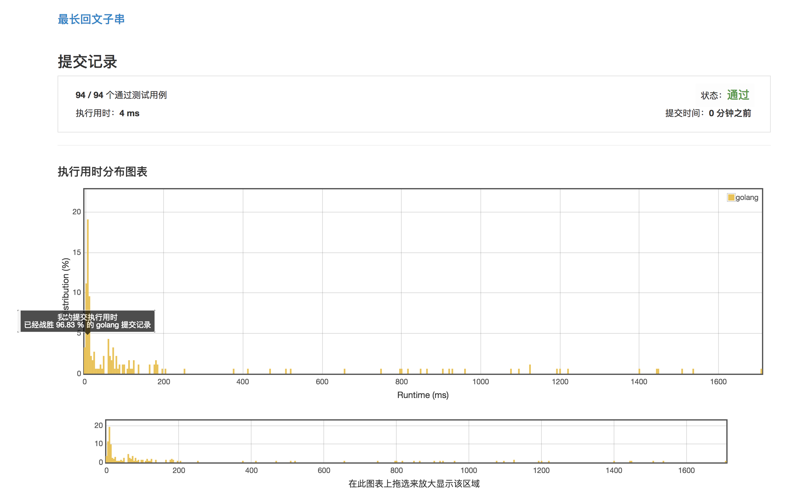

# [最长回文子串](https://leetcode-cn.com/problems/longest-palindromic-substring/description/)

***执行用时4ms***



***执行用时为 0 ms 的范例***

```golang
func longestPalindrome(s string) string {
	str := []byte(s)
	if len(s) < 2 {
		return s
	}
	index := 0
	maxLen,start := 1,0
	for index < len(s) {
		if maxLen/2 >= len(s) - index{
			break
		}
		j,k := index,index
		for k < len(s) - 1 && str[k+1] == str[k] {
			k++
		}
		index = k+1
		for k < len(s)-1 && j > 0 && str[j-1] == str[k+1] {
			j--
			k++
		}
		if k-j+1 > maxLen {
			start = j
			maxLen = k-j+1
		}
	}
	return (string(str[start:start + maxLen]))
}
```