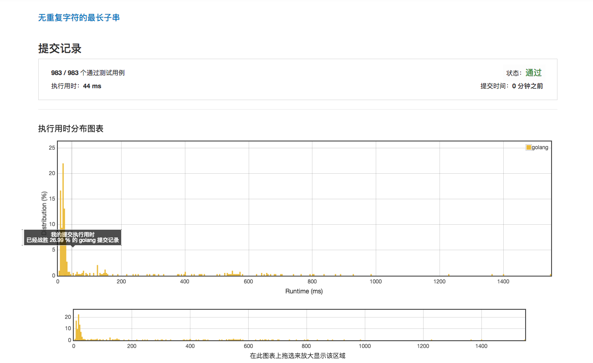

# 无重复字符的最长子串

*** 执行时间 44ms ! ***



*** 执行为4ms的范例 ***

```golang
func lengthOfLongestSubstring(s string) int {
	last, max, count := 1, 0, 0
	m := [128]int{}
	for index, value := range s {
		if m[value] < last {
			count += 1
		} else {
			last = m[value]
			if count > max {
				max = count
			}
			count = index - last + 1
		}
		m[value] = index + 1
	}
	if count > max {
		max = count
	}
	return max
}
```

*** 执行时间为16ms的范例 ***

```golang
func lengthOfLongestSubstring(s string) int {
    lastOccurred := make(map[byte]int)
    start := 0
    maxLength := 0
    
    for i, ch := range []byte(s) {
        lastI, ok := lastOccurred[ch]
        if ok && lastI >= start {
            start = lastI + 1
        }
        if i-start+1 > maxLength {
            maxLength = i-start+1
        }
        lastOccurred[ch] = i
    }
    
    return maxLength
}
```
