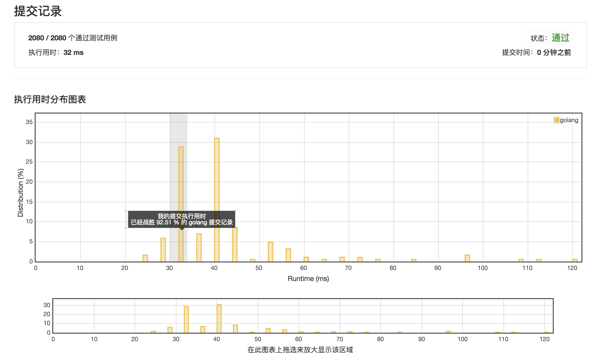

# [两个排序数组的中位数](https://leetcode-cn.com/problems/median-of-two-sorted-arrays/description/)

*** 执行用时：32 ms ***



*** 执行用时为 24 ms 的范例 ***

```golang

func findMedianSortedArrays(nums1 []int, nums2 []int) float64 {
	var total = len(nums1) + len(nums2)
	var mid = total / 2
	var median, previous, i, j, idx int

	for {
		var nums1Reached = i == len(nums1)
		var nums2Reached = j == len(nums2)

		if nums1Reached {
			median = nums2[j]
			j++
		} else if nums2Reached {
			median = nums1[i]
			i++
		} else {
			if nums1[i] > nums2[j] {
				median = nums2[j]
				j++
			} else {
				median = nums1[i]
				i++
			}
		}

		if idx == mid {
			break
		}
		idx ++
		previous = median
	}

	if (len(nums1)+len(nums2))%2 == 0 {
		return float64(median+previous) / 2.0
	} else {
		return float64(median)
	}
}

```