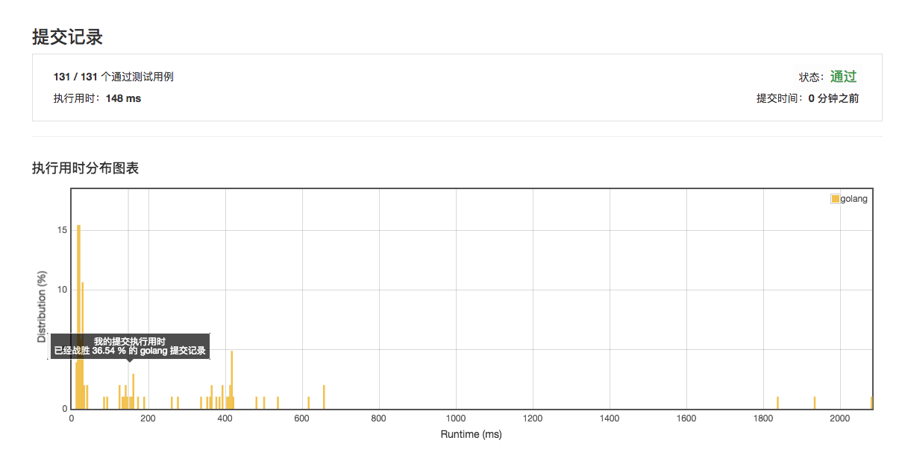
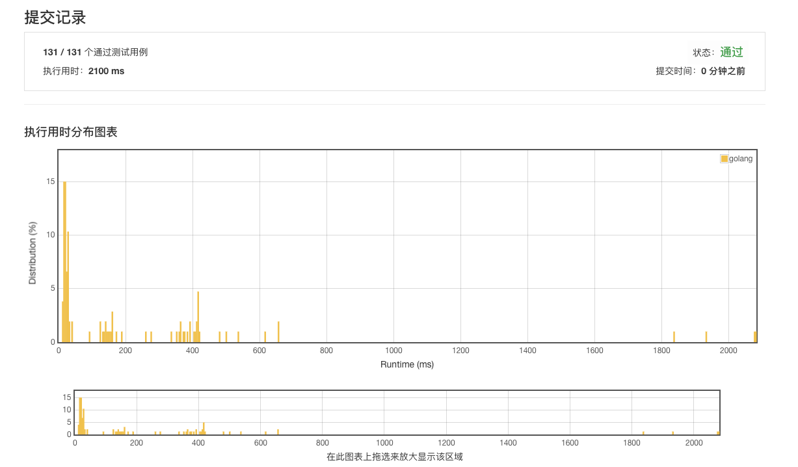
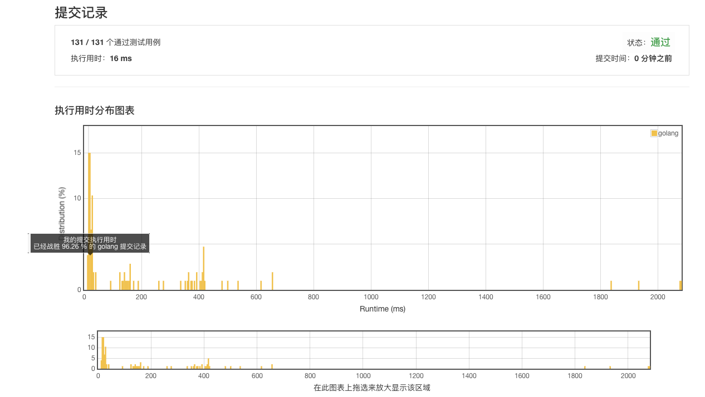

# [23. 合并K个排序链表](https://leetcode-cn.com/problems/merge-k-sorted-lists/description/)

## 10-5 148ms 36.54%



## 10-13 2100ms



## 参照范例 16ms



## 范例 12ms

```golang
func mergeKLists(lists []*ListNode) *ListNode {
	n := len(lists)

	if n == 0 {
		return nil
	}
	for n > 1 {
		k := (n + 1) / 2
		for i := 0; i < n/2; i++ {
			lists[i] = mergeTwoLists(lists[i], lists[i+k])
		}
		n = k
	}

	return lists[0]
}

func mergeTwoLists(l1 *ListNode, l2 *ListNode) *ListNode {
	res := &ListNode{}
	tmp := res
	h1 := l1
	h2 := l2

	for h1 != nil && h2 != nil {
		if h1.Val < h2.Val {
			tmp.Next = h1
			h1 = h1.Next
		} else {
			tmp.Next = h2
			h2 = h2.Next
		}

		tmp = tmp.Next
	}

	if h1 != nil {
		tmp.Next = h1
	} else {
		tmp.Next = h2
	}

	return res.Next
}
```
