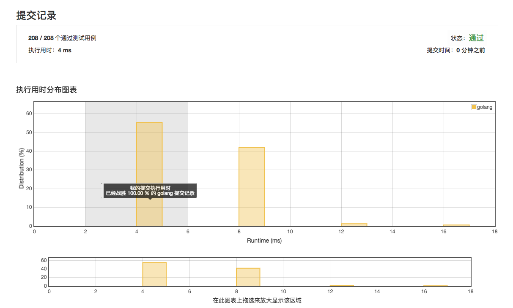

# [21. 合并两个有序链表](https://leetcode-cn.com/problems/merge-two-sorted-lists/description/)

## 4ms 100%



## 范例 4ms

```golang
func mergeTwoLists(l1 *ListNode, l2 *ListNode) *ListNode {
    var head, current, temp *ListNode
    for {
        if l1 == nil && l2 == nil {
            break
        } else if l1 == nil {
            temp = l2
            l2 = l2.Next
        } else if l2 == nil {
            temp = l1
            l1 = l1.Next
        } else {
            if l2.Val < l1.Val {
                temp = l2
                l2 = l2.Next
            } else {
                temp = l1
                l1 = l1.Next
            }
        }
        
        if head == nil {
            current = temp
            head = current
        } else {
            current.Next = temp
            current = current.Next
        }
    }
    
    return head
}
```
