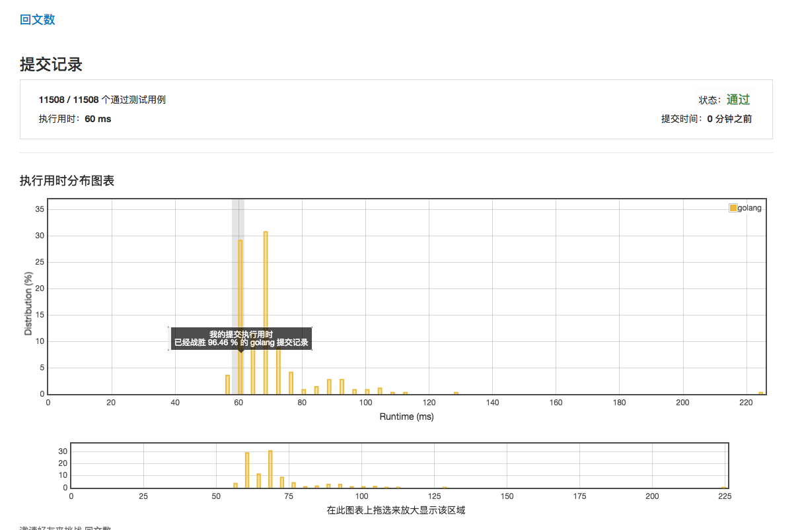

# [回文数](https://leetcode-cn.com/problems/palindrome-number/description/)

***执行用时 60ms***



***执行用时为 56 ms 的范例***

```golang
func isPalindrome(abc int) bool {
    if abc >=0 && abc <= 9 {
		return true
	}
    if abc < 0 || abc %10==0{
    	return false
	}
	x := abc
	r := 0
	for ; x >= 10; x = x / 10 {
		r += x % 10
		r *= 10
	}
    return abc == x+r
}
```
