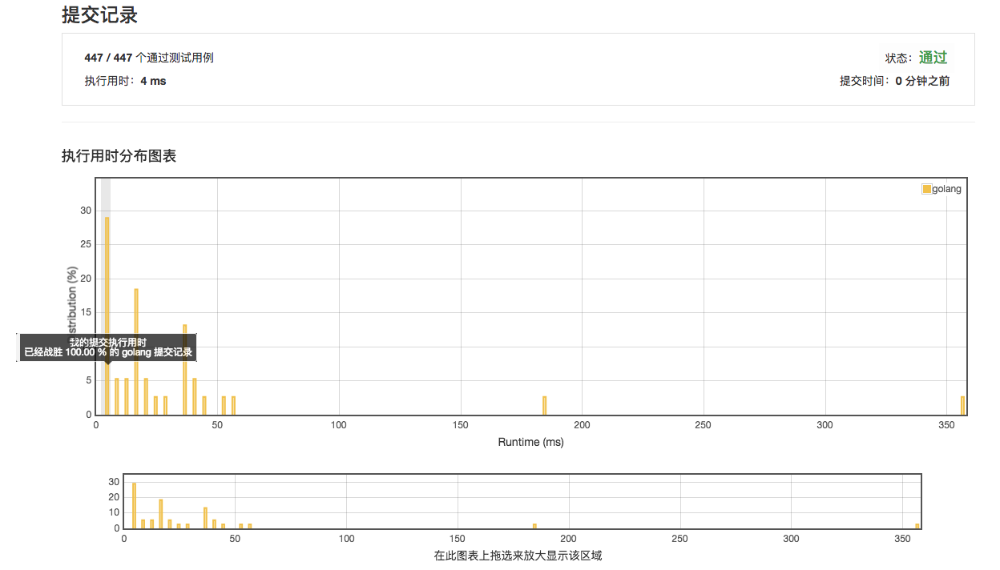

# [正则表达式匹配](https://leetcode-cn.com/problems/regular-expression-matching/description/)

***执行用时 4ms***



## 范例 4ms

```golang
func isMatch(s string, p string) bool {
	slen, plen := len(s), len(p)
	var dp [][]bool
	var t []bool
	for i := 0; i <= slen; i++ {
		t = make([]bool, plen+1)
		dp = append(dp, t)
	}
	for i := 0; i <= slen; i++ {
		for j := 0; j <= plen; j++ {
			if i == 0 && j == 0 {
				dp[i][j] = true
				continue
			} else if i == 0 {
				dp[i][j] = ((j-1)%2 == 1 && p[j-1] == '*' && dp[i][j-2])
				continue
			} else if j == 0 {
				dp[i][j] = false
				continue
			}
			if p[j-1] != '*' {
				dp[i][j] = (p[j-1] == s[i-1] || p[j-1] == '.') && dp[i-1][j-1]
			} else {
				if p[j-2] == '.' || p[j-2] == s[i-1] {
					dp[i][j] = dp[i-1][j]
				}
				if dp[i][j-2] == true {
					dp[i][j] = true
				}
			}
		}
	}
	return dp[slen][plen]
}
```