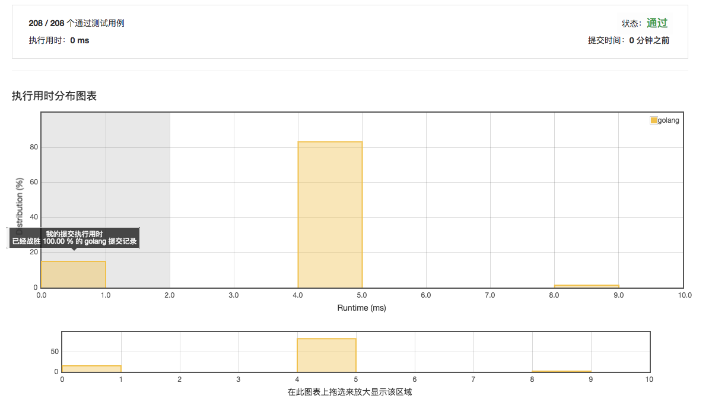

# [19. 删除链表的倒数第N个节点](https://leetcode-cn.com/problems/remove-nth-node-from-end-of-list/description/)

## 第一次提交 0ms 100%



## 范例 0ms

```golang
/**
 * Definition for singly-linked list.
 * type ListNode struct {
 *     Val int
 *     Next *ListNode
 * }
 */
func removeNthFromEnd(head *ListNode, n int) *ListNode {
  fast := head
	slow := head
	l := 0
	for fast.Next != nil  {
		if n <= 0 {
			slow = slow.Next
		}
		n--
		l++
		fast = fast.Next
	}

	if n == 1 { // 删除头节点
		return head.Next
	} else if n == -l { // 删除尾节点
		//slow.Next = nil
	} else {
		slow.Next = slow.Next.Next
	}
	return head
}
```