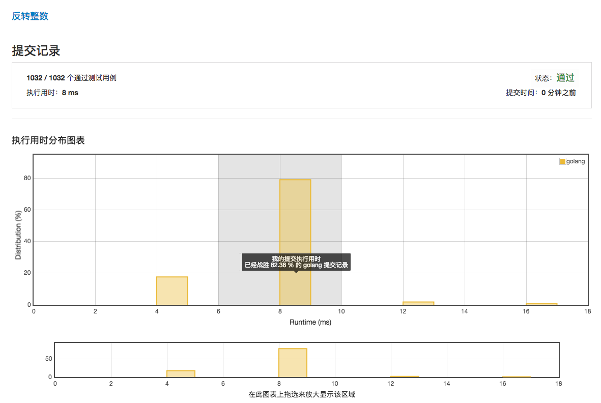

# [反转整数](https://leetcode-cn.com/problems/reverse-integer/description/)

***执行用时：8ms***



***执行用时为4 ms的范例***

```golang
func reverse(x int) int {
	result := 0
	for x != 0 {
		tmp := result*10 + x%10
		if tmp > math.MaxInt32 || tmp < math.MinInt32{
			return 0
		}

		result = tmp
		x /= 10
	}

	return result
}
```
