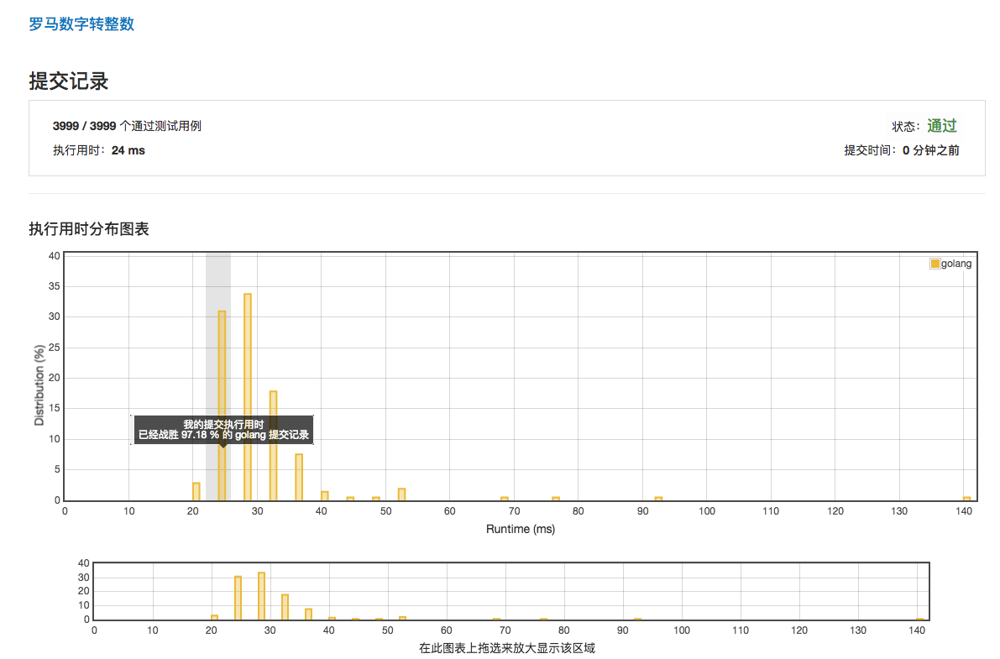

# [13. 罗马数字转整数](https://leetcode-cn.com/problems/roman-to-integer/description/)

## 第一次提交 24ms 97.18%



## 范例 20ms

```golang
func romanToInt(s string) int {
    sum:=0
    for i:=0;i<len(s);i++{
        switch s[i]{
        case 'I':
            if i==len(s)-1{
                sum+=1
                break
            }
            if s[i+1]=='V'{
                sum+=4
                i++       
            }else if s[i+1]=='X'{
                sum+=9
                i++
            }else{
                sum+=1
            }
        case 'X':
            if i==len(s)-1{
                sum+=10
                break
            }
            if s[i+1]=='L'{
                sum+=40
                i++
            }else if s[i+1]=='C'{
                sum+=90
                i++
            }else{
                sum+=10
            }
        case 'C':
            if i==len(s)-1{
                sum+=100
                break
            }
            if s[i+1]=='D'{
                sum+=400
                i++
            }else if s[i+1]=='M'{
                sum+=900
                i++
            }else{
                sum+=100
            }
        case 'V':sum+=5
        case 'L':sum+=50
        case 'D':sum+=500
        case 'M':sum+=1000
            default:panic("panic!not right roman number")
        }
    }
    return sum
}
```
