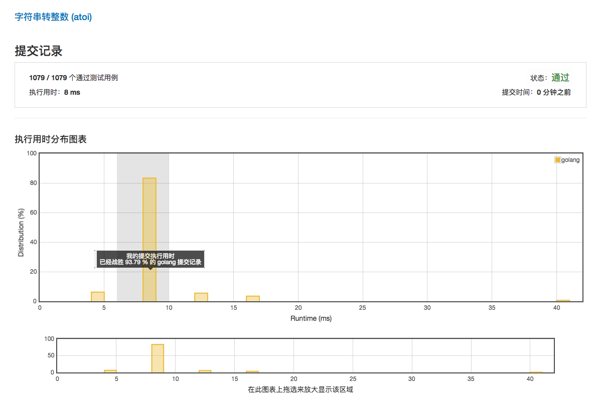

# [字符串转整数 (atoi)](https://leetcode-cn.com/problems/string-to-integer-atoi/description/)

***执行用时：8ms***



***执行用时为 4 ms 的范例***

```golang
func myAtoi(str string) int {
	//init
	strLen,sign,rs,idx:=len(str),1,0,0
	//skip whitespaces
	for idx<strLen && str[idx]==' '{
		idx++
	}
	//+-
	if idx<strLen{
		if str[idx]=='-'{
			sign=-1
			idx++
		}else{
			if str[idx]=='+'{
				idx++
			}
		}
	}
	//digits
	for ;idx<strLen;idx++{
		if str[idx]>='0' && str[idx]<='9'{
			rs = rs*10+int(str[idx]-'0')
      if rs*sign>math.MaxInt32{
          return math.MaxInt32
      }
      if rs*sign<math.MinInt32{
          return math.MinInt32
      }
		}else{
			break
		}
	}

	return rs*sign
}
```