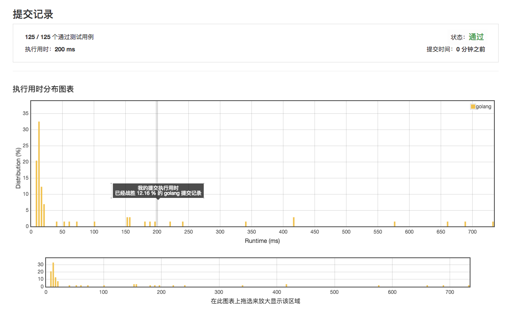

# [16. 最接近的三数之和](https://leetcode-cn.com/problems/3sum-closest/description/)

## 第一次提交 200ms 12.16%



## 范例 8ms

```golang

125 / 125 个通过测试用例
状态：通过
执行用时：200 ms
提交时间：1 周之前
执行用时分布图表
2.55.07.510.012.515.017.520.022.525.005101520253035
golang
Runtime (ms)Distribution (%)

01002003004005006007000102030
在此图表上拖选来放大显示该区域
邀请好友来挑战 最接近的三数之和
提交的代码：1 周之前
语言：golang


返回该题
× 关闭
执行用时为 8 ms 的范例
func threeSumClosest(nums []int, ttarget int) int {
    sort.Ints(nums)
    
    
    l := len(nums)
    if l <= 2 {
        return -1
    }
    
    r := nums[0] + nums[1] + nums[2]
    
    m := nums[0]-1
    for k := 0; k < l-2; k++ {
        if m == nums[k] {
            continue
        }
        m = nums[k]
        target := ttarget - nums[k]
        
        i := k + 1
        j := l - 1
        for ; i < j ; {
            t := nums[i] + nums[j] + m
            if abs(t - ttarget) < abs(r - ttarget) {
                r = t
            }
            
            if nums[i] + nums[j] < target {
                i++
            } else if nums[i] + nums[j] > target {
                j--
            } else {
                return ttarget
            }
        }
    }
    
    return r
}


func abs( a int ) int {
    if a > 0 {
        return a
    }
    
    return 0 - a
}
```
