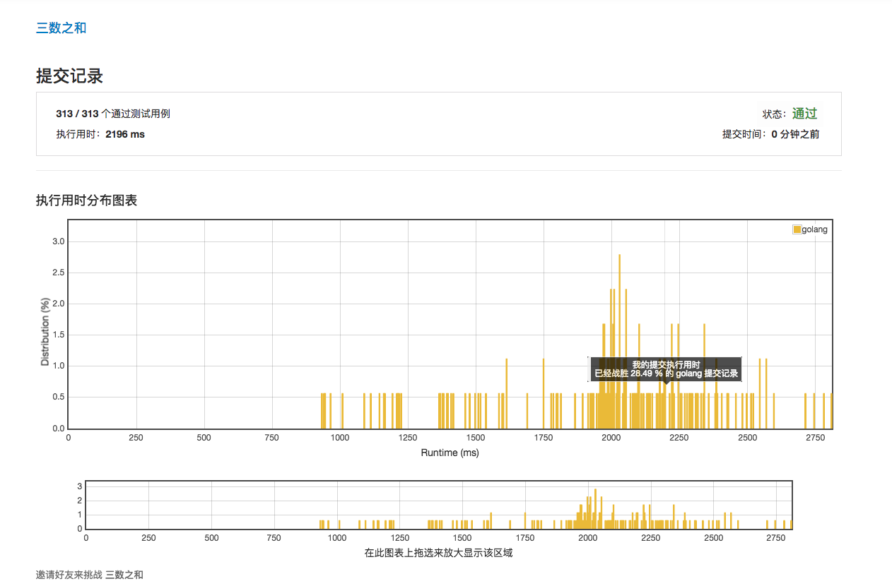
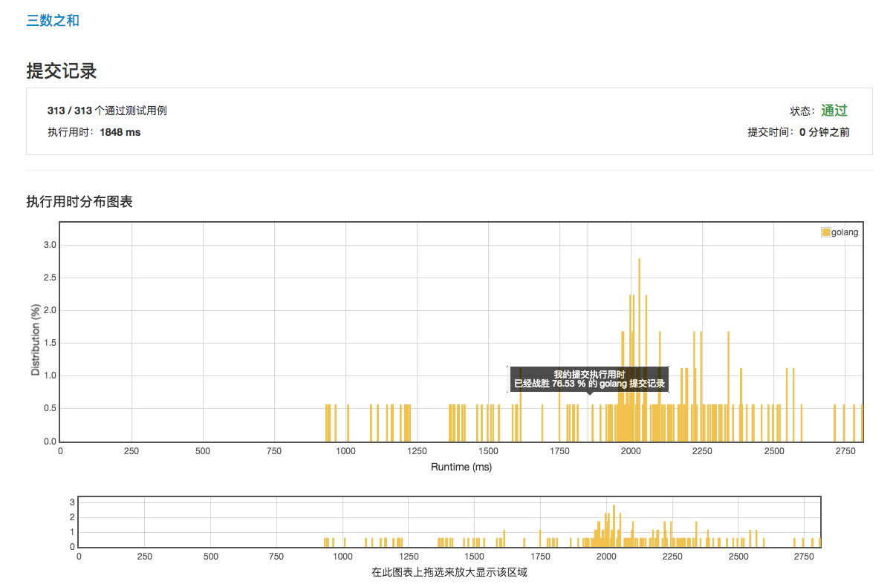
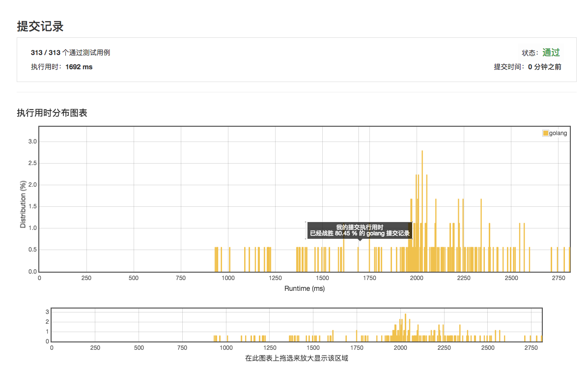
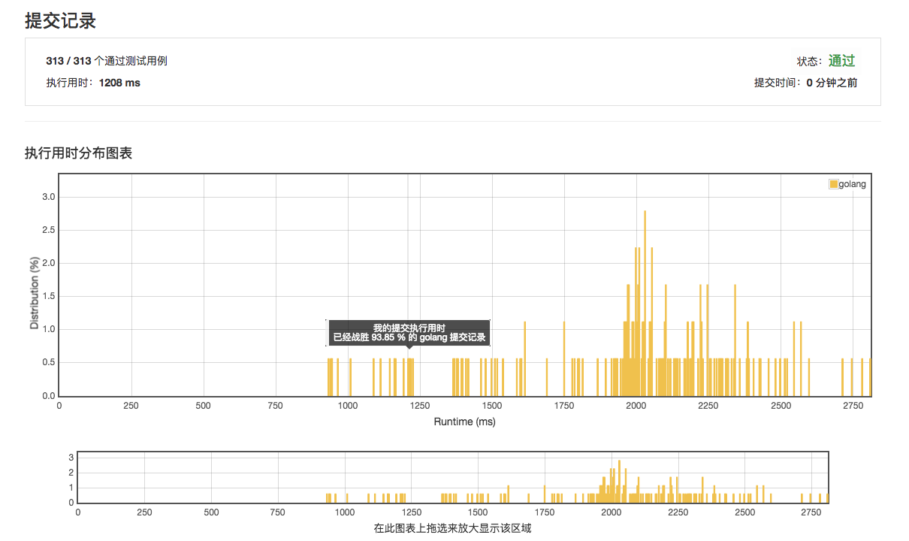

# [15. 三数之和](https://leetcode-cn.com/problems/3sum/description/)

## 第一次提交 2196ms 28.49%



## 第二次提交 1848ms 76.53%



## 第3次提交 1692ms 80.45%



## 第4次提交 1208ms 93.85%



## 执行用时为 932 ms 的范例

```golang
func threeSum(nums []int) [][]int {
	sort.Ints(nums)
	// xl.Info(nums)
	r := make([][]int, 0)
	l := len(nums)
	for i := 0; i < l-2; {
		a := nums[i]
		cnt := -a
		j := i + 1
		k := l - 1
		for {
			if j >= k {
				break
			}
			n := nums[j] + nums[k]
			if n == cnt {
				// xl.Info(i, j, k, nums[i], nums[j], nums[k])
				r = append(r, []int{nums[i], nums[j], nums[k]})
				j0 := j
				k0 := k
				for j < l-1 {
					// xl.Info("j++", j, "->", j+1)
					j++
					if nums[j0] != nums[j] {
						break
					}
				}
				for k > j {
					// xl.Info("k--", k, "->", k+1)
					k--
					if nums[k0] != nums[k] {
						break
					}
				}
			} else if n > cnt {
				k--
			} else if n < cnt {
				j++
			}
		}
		for i < l-2 {
			i++
			if nums[i] != a {
				break
			}
		}
	}
	return r
}
```
