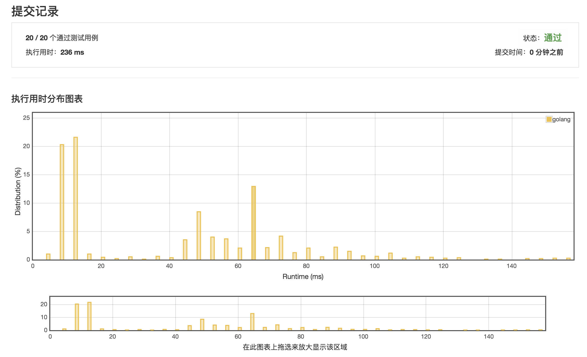

# 两数之和

https://leetcode-cn.com/submissions/detail/3589865/

**提交记录: 236ms !!!!!**



**执行用时为4ms的范例**

```golang
func twoSum(nums []int, target int) []int {
    result := make([]int, 2)
    m := make(map[int]int)
    for i := 0; i < len(nums); i++ {
        if _, ok := m[target-nums[i]]; ok {
            result[1] = i
            result[0] = m[target - nums[i]]
            break
        }
        m[nums[i]] = i
    }
    return result
}
```