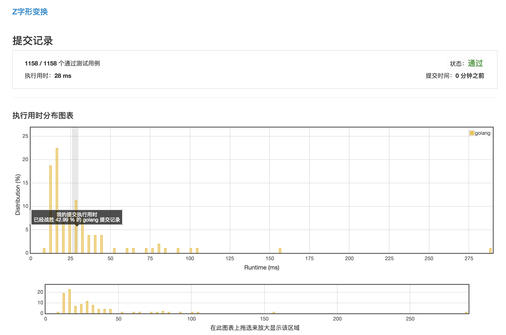

# [Z字形变换](https://leetcode-cn.com/problems/zigzag-conversion/description/)

***执行用时：28ms***



***执行用时为 8 ms 的范例***

```golang
func convert(s string, numRows int) string {
	m := make([]byte, 0)
	l := len(s)
	if numRows == 1 {
		return s
	}
	one_step := 2*numRows - 2
	for i := 0; i < numRows; i++ {
		if i == 0 || i == (numRows-1) {
			for x := i; x < l; x += one_step {
				m = append(m, s[x])
			}
		} else {
			x, y := i, 2*(numRows-1)-i
			for x < l || y < l {
				if x < l {
					m = append(m, s[x])
				}
				if y < l {
					m = append(m, s[y])
				}
				x += one_step
				y += one_step
			}
		}
	}
	return string(m)
}
```

***执行用时为 12 ms 的范例***

```golang
func convert(s string, numRows int) string {
    if numRows <= 1 {
        return s
    }
    span := numRows + numRows - 2
    length := len(s)
    var res []byte
    
    for head := 0; head < length; head += span{
        res = append(res, s[head])
    }
    for start := 1; start < numRows - 1; start ++{
        head := start
        for head < length {
            res = append(res, s[head])
            if head + span - start*2 < length {
                res = append(res, s[head + span - start*2])
            }
            head += span
        }
    }
    
    for head := numRows - 1; head < length; head += span{
        res = append(res, s[head])
    }
    return string(res[:])
}
```
