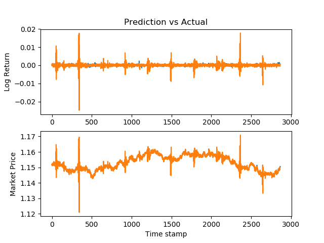

# [VivekPa/AIAlpha](https://github.com/VivekPa/AIAlpha)

## python run.py

实际上仅调用了 `model_20_encoded.py` 的 `nnmodel`

```bash
localhost:AIAlpha zhuyu$ python run.py
/anaconda3/lib/python3.6/site-packages/h5py/__init__.py:36: FutureWarning: Conversion of the second argument of issubdtype from `float` to `np.floating` is deprecated. In future, it will be treated as `np.float64 == np.dtype(float).type`.
  from ._conv import register_converters as _register_converters
Using TensorFlow backend.
(11463, 20)
Epoch 1/500
2019-01-09 15:39:42.177661: I tensorflow/core/platform/cpu_feature_guard.cc:141] Your CPU supports instructions that this TensorFlow binary was not compiled to use: AVX2 FMA
11463/11463 [==============================] - 0s 34us/step - loss: 0.2751
Epoch 2/500

Epoch 499/500
11463/11463 [==============================] - 0s 22us/step - loss: 2.9080e-04
Epoch 500/500
11463/11463 [==============================] - 0s 22us/step - loss: 2.9029e-04

Regularizer for 1: 0.01 
Regularizer for 2: 0.01 
Epochs: 500
Predicted Price r^2 value: 0.8481625295138551 
Predicted return r^2 value: -0.030145485925549664
Predict Price MSE: 3.6385749553384744e-06 
Predicted Return MSE: 2.8270796320135502e-06
[[1.14989785]]
Price Accuracy Average = 99.92615274874485 
Price Accuracy Standard Deviation = 0.15062761509671402
```

## python model_20_encoded.py

```bash
localhost:AIAlpha zhuyu$ python model_20_encoded.py 
/anaconda3/lib/python3.6/site-packages/h5py/__init__.py:36: FutureWarning: Conversion of the second argument of issubdtype from `float` to `np.floating` is deprecated. In future, it will be treated as `np.float64 == np.dtype(float).type`.
  from ._conv import register_converters as _register_converters
Using TensorFlow backend.
(11463, 20)
Epoch 1/500
2019-01-09 16:37:13.511090: I tensorflow/core/platform/cpu_feature_guard.cc:141] Your CPU supports instructions that this TensorFlow binary was not compiled to use: AVX2 FMA
11463/11463 [==============================] - 0s 36us/step - loss: 0.5360
Epoch 2/500


Regularizer for 1: 0.05 
Regularizer for 2: 0.01 
Epochs: 500
Predicted Price r^2 value: 0.9004050400573448 
Predicted return r^2 value: -0.036983407335996255
Predict Price MSE: 2.2419316023207804e-06 
Predicted Return MSE: 1.7534201742415149e-06
[[1.14998107]]
Price Accuracy Average = 99.93787510173533 
Price Accuracy Standard Deviation = 0.11698603741923409
```


